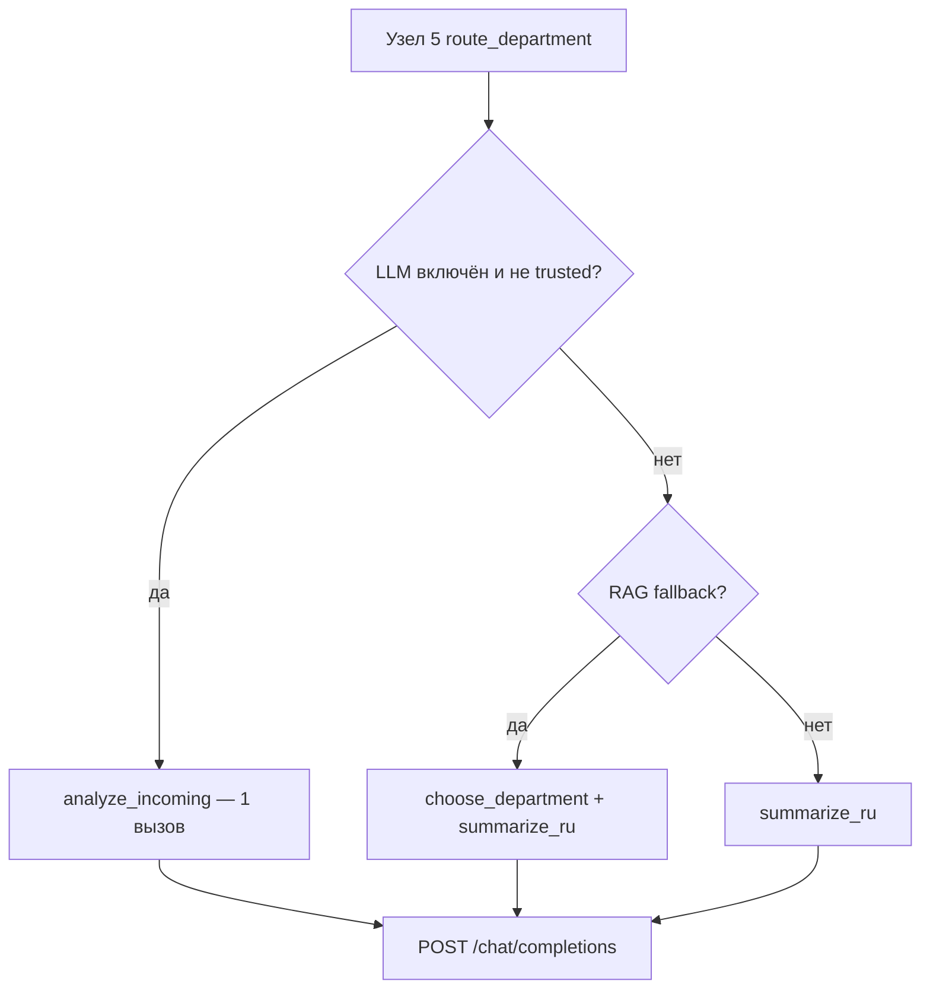

# Какой запрос отправляется агенту (LLM)

**Кратко:** в основном потоке обработки письма LLM вызывается **один раз** в узле `route_department` (узел 5) через метод `analyze_incoming` — combined-промпт «спам + отдел + обзор». 

---

## 1. Когда и какой вызов делается

Логика в `node_route_department` (`n5_route_department.py`):


| Условие                                                                   | Метод LLM                                | Число вызовов                  |
| ------------------------------------------------------------------------- | ---------------------------------------- | ------------------------------ |
| `LLM_GATEWAY_URL` задан, `USE_STUBS=false`, отправитель **не** доверенный | `analyze_incoming()`                     | **1** (спам + отдел + summary) |
| Доверенный отправитель **или** нет LLM, но был RAG-fallback               | `choose_department()` + `summarize_ru()` | **2**                          |
| Доверенный / нет LLM, RAG не нужен                                        | только `summarize_ru()`                  | **1**                          |
| HITL после подтверждения оператором                                       | `summarize_ru()` через `node_summarize`  | **1**                          |


```171:203:src/agent_pochta/nodes/n5_route_department.py
    if not skip_spam and use_llm_analyze:
        analysis = container.llm.analyze_incoming(
            email,
            text,
            llm_candidates,
            sender=sender,
            skip_spam_check=skip_spam,
        )
        ...
    elif rag_used:
        ...
        choice = container.llm.choose_department(text, llm_candidates)
        routing = _routing_from_choice(choice)
        summary_ru = container.llm.summarize_ru(...)
    else:
        summary_ru = container.llm.summarize_ru(...)
```

Узел 2 (`spam_filter`) **не** вызывает LLM — спам-классификация перенесена в узел 5:

```37:38:src/agent_pochta/nodes/n2_spam_filter.py
    # LLM-спам перенесён в узел 5 (один API-вызов на письмо вместе с отделом и обзором).
    return {"trace": trace}
```

---


## 2. Основной промпт (combined analyze) — **главный путь**

**Где строится:** `build_analyze_messages()` в `llm_analyze.py`  
**Где отправляется:** `ChatCompletionsLLMGateway.analyze_incoming()` → `_chat_json()` в `http_llm.py`

### System prompt

```51:65:src/agent_pochta/services/llm_analyze.py
    system = (
        "Ты помощник офис-менеджера НПО «Турбулентность-ДОН». "
        "Проанализируй входящее письмо за один ответ.\n\n"
        f"{spam_block}"
        "2) Отдел: выбери РОВНО один department_id из candidates; "
        "dept_confidence 0..1, reasoning.\n"
        f"3) Обзор summary_ru на русском ({min_sent}–{settings.summary_max_sentences} предложений): "
        "кто написал, суть, что сделать, вложения, срок если указан.\n\n"
        "Ответь строго JSON:\n"
        "{"
        f'{spam_json_fields}'
        '"department_id": "...", "department_name": "...", '
        '"dept_confidence": float, "reasoning": "...", "summary_ru": "..."'
        "}"
    )
```

Блок спама (`spam_block`) добавляется, если проверка спама не пропущена:

```
Ты помощник офис-менеджера НПО «Турбулентность-ДОН». 
Проанализируй входящее письмо за один ответ.

1) Спам: is_spam, spam_confidence (0=не спам, 1=спам), spam_reason. 
Реклама/семинары/фишинг — спам. Деловые запросы контрагентов — не спам. 
Пересланные письма: несовпадение From и текста — норма.

2) Отдел: выбери РОВНО один department_id из candidates; 
dept_confidence 0..1, reasoning.

3) Обзор summary_ru на русском (3–5 предложений): 
кто написал, суть, что сделать, вложения, срок если указан.

Ответь строго JSON:
{"is_spam": bool, "spam_confidence": float, "spam_reason": "...", 
"department_id": "...", "department_name": "...", 
"dept_confidence": float, "reasoning": "...", "summary_ru": "..."}
```


### User prompt

Это **JSON-строка** (`json.dumps`), собранная из контекста письма + кандидатов отделов:

```67:82:src/agent_pochta/services/llm_analyze.py
    ctx = build_summary_context(email, combined_text, sender=sender)
    ctx["candidates"] = candidates
    if skip_spam_check:
        ctx["spam_check"] = "skipped_trusted_sender"
    else:
        _, spam_user = build_spam_llm_messages(email, settings)
        spam_ctx = analyze_spam_context(email, settings)
        ctx["spam_hints"] = {
            "is_forwarded": spam_ctx.is_forwarded,
            "embedded_sender": spam_ctx.embedded_sender,
            "trusted_domains": settings.trusted_domain_list,
        }
        ctx["email_for_spam"] = spam_user

    user = json.dumps(ctx, ensure_ascii=False)
```

Поля user JSON:

- `build_summary_context(email, combined_text, sender=sender)` 
- `candidates` — список отделов
- `spam_check: "skipped_trusted_sender"` — если доверенный отправитель
- `spam_hints`: `{is_forwarded, embedded_sender, trusted_domains}`
- `email_for_spam` — текстовое представление письма для спам-анализа


### Ожидаемый ответ LLM (JSON)

```json
{
  "is_spam": false,
  "spam_confidence": 0.1,
  "spam_reason": "...",
  "department_id": "00-000123",
  "department_name": "Отдел закупок",
  "dept_confidence": 0.85,
  "reasoning": "...",
  "summary_ru": "Краткий обзор на русском..."
}
```

---


## 3. Данные в user JSON (что именно уходит в LLM)

Из `build_summary_context()` (`summary.py`):


| Поле                                    | Содержимое                                                                   |
| --------------------------------------- | ---------------------------------------------------------------------------- |
| `sender_name`, `sender_email`           | Отправитель                                                                  |
| `subject`                               | Тема                                                                         |
| `body_and_attachments`                  | Текст письма + извлечённый текст вложений (до ~12 000 символов, без подписи) |
| `attachments_count`, `attachment_names` | Метаданные вложений                                                          |
| `attachments`                           | `[{filename, mime_type, ocr_used, has_text}, ...]`                           |
| `contractor_name`, `contractor_type`    | Если контрагент найден в RAG (узел 3)                                        |
| `candidates`                            | Список отделов-кандидатов                                                    |
| `spam_hints`                            | `{is_forwarded, embedded_sender, trusted_domains}`                           |
| `email_for_spam`                        | Текстовое представление письма для спам-анализа                              |


**Кандидаты отделов** (`candidates`):

- **По правилам** (обычный случай): один отдел из RuleRouter — `{"department_id": "...", "department_name": "..."}`
- **После RAG** (низкая уверенность / конфликт / резерв): до 5 отделов из Qdrant — `{"department_id", "department_name", "head_name", "responsibility"}`

---


## 4. Вспомогательные промпты (альтернативные пути)


### A. Спам-классификатор (`build_spam_llm_messages`)

**Файл:** `rules/spam_context.py`  
**Используется:** внутри combined analyze (поле `email_for_spam`) и отдельно в `classify_spam()` (в графе сейчас не вызывается).

**System:**

> «Ты классификатор спама для корпоративной почты НПО «Турбулентность-ДОН». confidence — вероятность СПАМА (0..1). Ответь строго JSON: `{"is_spam", "confidence", "reason"}`. Правила: доверенные домены …, пересылки — норма, деловые запросы — не спам, спам — реклама/фишинг/…»

**User** — многострочный текст:

```
От: sender@example.com
Имя отправителя: ...
Reply-To: ... (если есть)
Тема: ...
Метка: пересланное письмо (если FW/Re)
Метка: доверенный домен (если применимо)
Оригинальный отправитель в тексте: ... (если найден)

<тело письма, до 4000 символов>
```


### B. Выбор отдела (`choose_department`)

**Файл:** `http_llm.py`

**System:**

> «Выбери ровно один отдел из candidates для входящего письма. JSON: `{"department_id","department_name","confidence":0..1,"reasoning"}`»

**User JSON:**

```json
{
  "email_text": "<combined_text, до 8000 символов>",
  "candidates": [...]
}
```


### C. Обзор (`summarize_ru`)

**Файл:** `http_llm.py`

**System:**

> «Ты помощник офис-менеджера НПО «Турбулентность-ДОН». Сделай краткий деловой обзор (3–5 предложений): кто написал; суть; что сделать; вложения; срок. Без приветствий. JSON: `{"summary_ru": "..."}`»

**User JSON:** тот же `build_summary_context()` + опционально `department_name`, `priority`.

**Fallback** (если JSON пустой): `_chat_plain()` с system «Сформируй краткий деловой обзор…» и user = JSON контекста.

---


## 5. Формат API-вызова

**Класс:** `ChatCompletionsLLMGateway` (`http_llm.py`)  
**Endpoint:** `POST {LLM_GATEWAY_URL}/chat/completions`  
**Совместимость:** OpenAI Chat Completions (LM Studio, vLLM, OpenRouter, Groq)

### JSON payload (`_chat_json`)

```203:221:src/agent_pochta/services/http_llm.py
    def _chat_json(self, system: str, user: str) -> dict:
        payload = {
            "model": self._model,
            "messages": [
                {"role": "system", "content": system},
                {"role": "user", "content": user},
            ],
            "temperature": 0.1,
        }
        if self._use_json_response_format():
            payload["response_format"] = {"type": "json_object"}
```

```json
{
  "model": "<LLM_DEFAULT_MODEL, по умолчанию qwen/qwen3.5-9b>",
  "messages": [
    {"role": "system", "content": "<system prompt>"},
    {"role": "user", "content": "<user prompt>"}
  ],
  "temperature": 0.1,
  "response_format": {"type": "json_object"}
}
```


| Параметр          | Значение                                                                                       |
| ----------------- | ---------------------------------------------------------------------------------------------- |
| `model`           | из `.env` → `LLM_DEFAULT_MODEL` (по умолчанию `qwen/qwen3.5-9b`)                               |
| `messages[0]`     | `role: "system"` — инструкции                                                                  |
| `messages[1]`     | `role: "user"` — JSON или текст письма                                                         |
| `temperature`     | `0.1` (JSON), `0.2` (plain fallback)                                                           |
| `response_format` | `{"type": "json_object"}` — только для OpenRouter/OpenAI/Groq; для LM Studio убирается при 400 |


**Заголовки:**

- `Content-Type: application/json`
- `Authorization: Bearer {LLM_GATEWAY_API_KEY}` (если задан)
- Для OpenRouter: `HTTP-Referer`, `X-Title: agent-pochta`

**Ответ:** парсится `choices[0].message.content` → извлекается JSON-объект (`parse_json_object`).

---


## 6. System vs User — итог


| Вызов                           | System                         | User                                                                       |
| ------------------------------- | ------------------------------ | -------------------------------------------------------------------------- |
| **analyze_incoming** (основной) | Роль + 3 задачи + схема JSON   | JSON: письмо, вложения, контрагент, candidates, spam_hints, email_for_spam |
| **classify_spam**               | Правила спама + схема JSON     | Текст письма (From, тема, тело)                                            |
| **choose_department**           | Инструкция выбрать отдел       | JSON: `email_text` + `candidates`                                          |
| **summarize_ru**                | Инструкция обзора + схема JSON | JSON контекста письма                                                      |


---


## 7. Схема потока




---


## 8. Ключевые файлы


| Путь                                            | Назначение                                                                       |
| ----------------------------------------------- | -------------------------------------------------------------------------------- |
| `src/agent_pochta/services/llm_analyze.py`      | `build_analyze_messages()` — основной combined-промпт                            |
| `src/agent_pochta/services/http_llm.py`         | `ChatCompletionsLLMGateway`, `_chat_json()`, `choose_department`, `summarize_ru` |
| `src/agent_pochta/services/summary.py`          | `build_summary_context()` — контекст для user JSON                               |
| `src/agent_pochta/rules/spam_context.py`        | `build_spam_llm_messages()` — спам-промпт                                        |
| `src/agent_pochta/nodes/n5_route_department.py` | Узел, вызывающий LLM                                                             |
| `src/agent_pochta/nodes/n2_spam_filter.py`      | LLM не вызывается (спам перенесён в узел 5)                                      |


**Итог:** агенту уходит стандартный chat completion с **system-промптом-инструкцией** и **user-сообщением с данными письма** (в основном случае — один большой JSON). Промпты собираются в `llm_analyze.py`, `spam_context.py`, `summary.py` и отправляются через `http_llm.py`.